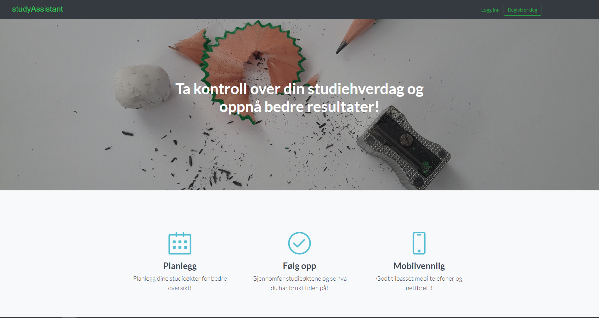

# Welcome to the studyAssistant API documentation
Here you'll find a reference to the various classes used in the project.
## Try out the app
If you want to try the app for yourself, there's a [live version on Azure](http://studyassistant.azurewebsites.net).

